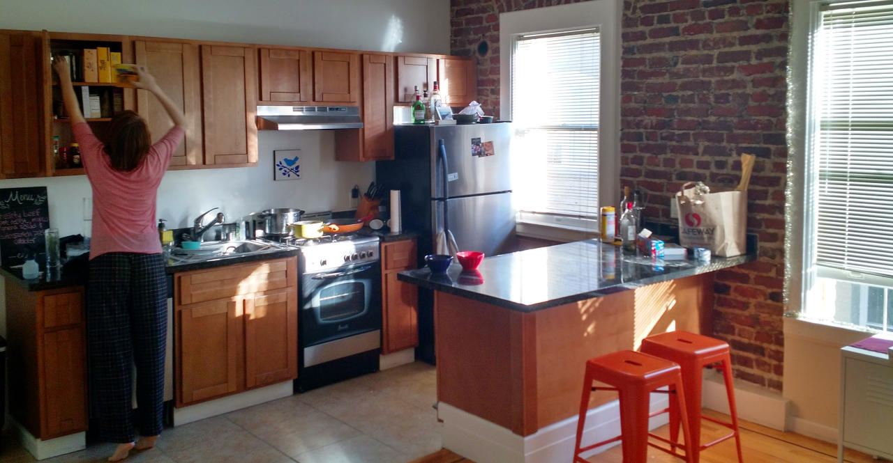
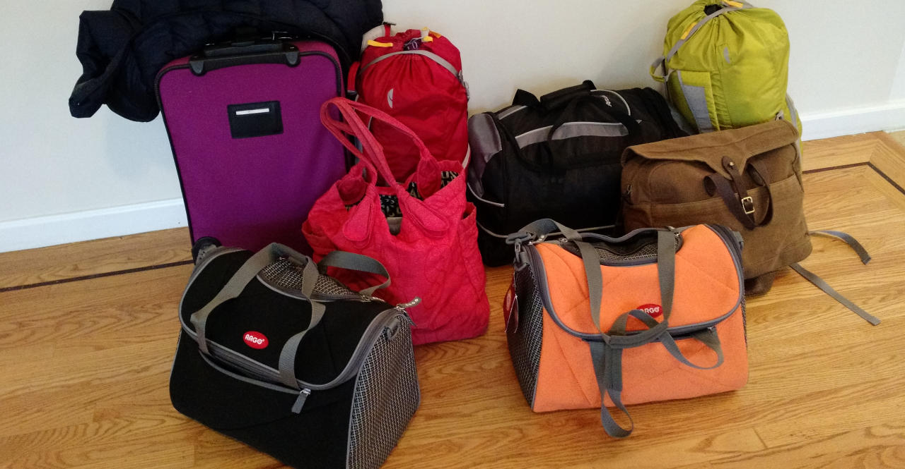

We'll probably miss the place eventually. We miss the people already.

# Out of SF

I pulled at the tether of San Francisco for most of the year we lived
there until - finally - we escaped! We missed our friends immediately, so it was a bittersweet
escape, but I expect we'll cross paths frequently and soon.
(Seattle is beautiful - come visit!)

Sometimes a place just rubs you the wrong way, and that's how it was with us and SF.
Partly, our bad experiences stemmed from the Tenderloin, the seedy neighborhood in which we found our "affordable" $2,600 apartment.
In the Tenderloin, walking became an exercise of balance: watching for shit and refuse
on the sidewalk while also avoiding the paths of angry junkies and naked folks rifling through trash cans.
Drug exchanges, self-injections from needles between toes, and furious rants at the world became everyday sights.
We had to call the police twice, once while chasing down a burglar and again when a neighbor was assaulted by her husband.
Amanda felt unsafe walking alone and I sometimes carried a knife at night.

- [See for yourself](https://www.google.com/search?q=the+tenderloin+sf&espv=2&biw=1391&bih=805&source=lnms&tbm=isch&sa=X&ei=NPOyVN_NCZHvoASC5ILwCQ&ved=0CAcQ_AUoAg)

It isn't just the Tenderloin that pushed us away, though.
The whole city sent signals through price and policy that shouted "LEAVE!"
Apartments in nicer neighborhoods started around $3,200.
Our [horrible landlord](http://www.yelp.com/biz/mosser-companies-san-francisco)
had no incentive to be responsive since our absence would give them an open spot,
fillable immediately, with a rate increase of several hundred dollars.
10.8% of our income was "redistributed" and what was left was eaten by
$600 towing fees, $11 sandwiches, and countless Lyft rides in this walkable-but-not-really city.

- [Rents in SF](http://i.bullfax.com/imgs/957b73733bbc6918bb9c344ddc7a6362d71e202e.jpg)

# Selling our stuff

# Our Flight

Packing light

We spent last weekend selling all of our things.

Alaska Air

Cats in planes

Kitten and Fatty weren't happy flyers, but they did great anyway.
