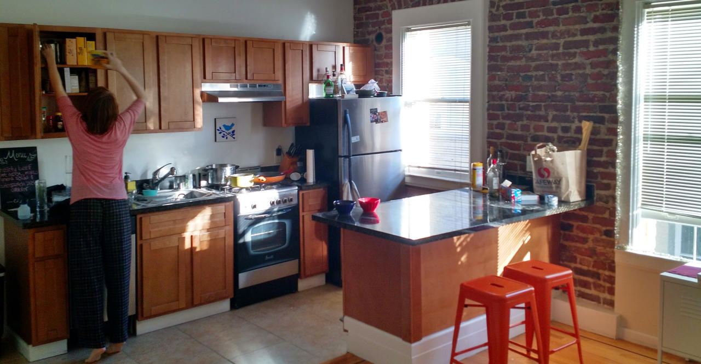
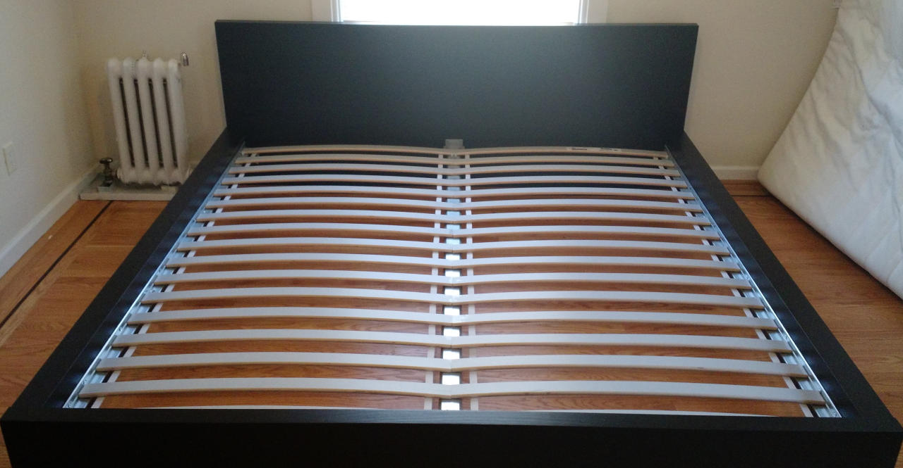
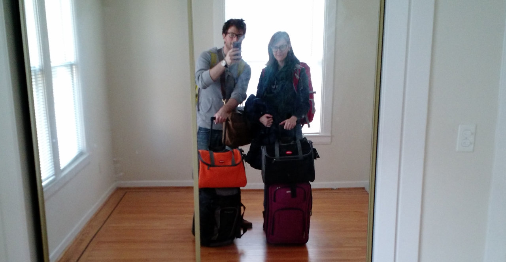

We'll probably miss the place eventually. We miss the people already.

# The Tenderloin

As I walked home from [Bob's Donuts](http://www.yelp.com/biz/bobs-donut-and-pastry-shop-san-francisco-2) recently,
two people asked me for cash,
I passed a pants-less man rifling through a trashcan,
and one prostitute offered to 'suck my ****.'
It was about eleven on a Monday night.

Amanda and I spent 2014 in [the Tenderloin](https://www.google.com/search?q=the+tenderloin+sf&espv=2&biw=1391&bih=805&source=lnms&tbm=isch&sa=X&ei=NPOyVN_NCZHvoASC5ILwCQ&ved=0CAcQ_AUoAg),
SF's seediest neighborhood.
We called the police twice, chased down a burglar, and interceded when a
neighbor was being assaulted by her husband.
We learned to walk with our heads on swivels - looking down frequently for
refuse, feces, and syringes on the sidewalk but maintaining constant vigilence for
angry junkies raging at the world.
I sometimes carried a knife and Amanda stopped walking south alone because it was too frightening.

Our apartment, run by [slum lords](http://www.yelp.com/biz/mosser-companies-san-francisco),
was totally neglected.
In SF, it pays to be a bad landlord, as demand will propel new tenants to you as
soon as the old ones leave.
Fair housing laws reset with each new set of tenants,
allowing you to raise rents by hundreds of dollars at the turnover.
Unfortunately, this creates a strong incentive to stay in terrible places
since exploding rents ensure that your "deal" from a few months ago is better than
anything you could find today.

# San Francisco

It was more than the Tenderloin.
The whole city sent signals through price and policy that shouted "LEAVE!" from our first day.
I remember looking at my first *massive* SF paycheck and wondering, "where did all that money go?"
In San Francisco, for every dollar you make, you keep about $0.64.
Welcome to the highest income taxes in the country!
California also takes first place for sales tax at 8.25%.
The rest disappears piecemeal to $600 towing fees, $12 sandwiches,
and countless Lyft rides to overcome a broken transit system.

When we left, one-bedroom apartments in decent neighborhoods started out [around $3,250](http://i.bullfax.com/imgs/957b73733bbc6918bb9c344ddc7a6362d71e202e.jpg) -
about the price of a new BMW 328i *every year.*
I would happily pay that kind of money to live, say, on an island paradise, in a space station,
or possibly somewhere in Disney World.
Sadly, even the best SF neighborhoods lack beaches warm enough to swim in,
zero-G space walks, and magic carpet rides.

# Seattle

Amanda and I were of one mind regarding SF: great friends, boundless opportunity, soul-crushing quality of life.
When her awesome employer [Threadflip](http://www.threadflip.com/)
agreed to try a remote team, we began looking at destinations immediately.

Primarily, I wanted to escape California.
Our ideal place would be walkable, beautiful, relatively affordable,
and near the Pacific time zone so we could easily collaborate with our teams.
The west coast has [three truly walkable cities](https://www.walkscore.com/cities-and-neighborhoods/)...
but two of them are in California.

The third? Seattle!
Other benefits: zero state income tax, coffee and microbrew culture, snowboarding, day trips to Canada.

# Selling our stuff

When we moved to the west coast, we sent our stuff in a separate moving van.
This was *a good move &trade;* because it allowed us to pretend through the whole road trip that
we weren't tethered to thousands of pounds of junk... even though we were.
What did we take? What did we leave? I don't even remember.

This time, we decided to jettison our possessions in favor of traveling light.
We'd already sold our vehicles since keeping an automobile in downtown SF is a special kind of nightmare,
so the rest was just household... stuff.

We sold *everything*.

Our flights crept up on us so I ended up hosting a 3-day Craigslist fire sale over the weekend.
We managed to sell almost everything of real value, minus Amanda's glockenspiel.
That, she donated to a local elementary school.
We also gave away a few nice hobby things to friends who will use them well.
I also discovered that, no matter the price listed, *someone* on Craigslist will offer you thirty bucks for it.
Oh sweet, slow Craigslist, underbelly of the Internet.

Ultimately, this is everything we took with us, including cats.
Fatty and Kitten are in the black and orange Argo bags at the front!

We can carry all of our worldly possessions on our persons - the cat boxes
strap onto the handles of the rolling duffels. It's pretty sweet.
