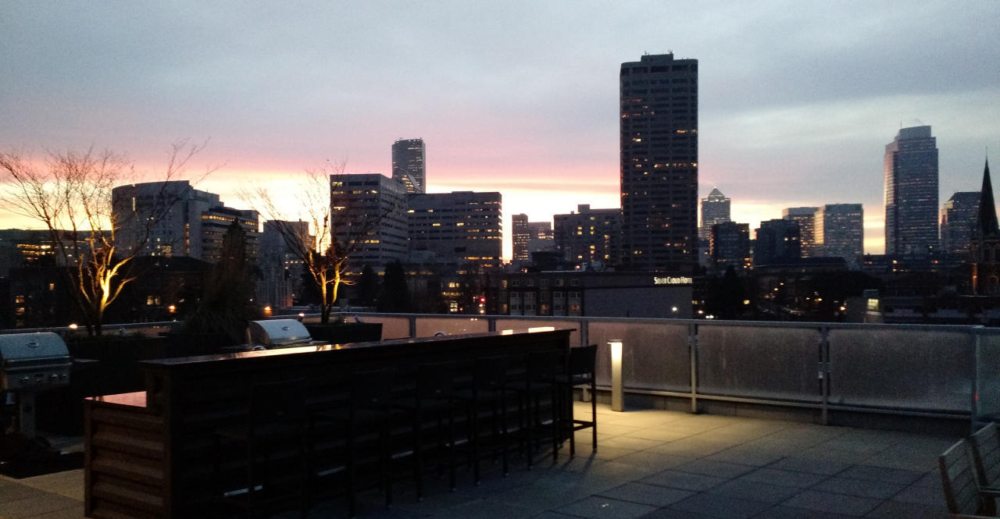
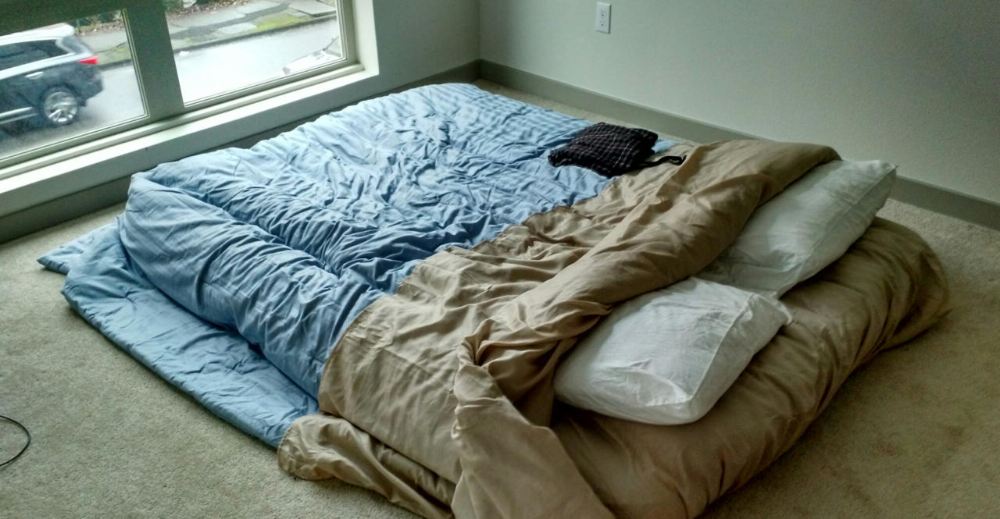

The view from our apartment's rooftop patio makes it tempting to bundle up and grill something soon.

# Tragedy

The last time we chose an apartment without knowing the city,
we ended up in the Tenderloin where [catcalls precipitate brutal stabbings](http://abc7news.com/news/sf-man-stabbed-9-times-after-defending-his-girlfriend-/404960/).
For Washington, we booked a full month of AirBnB for $1,800 so we could scope out the area before signing a lease.
As you might imagine, it's tricky to score 31 days of pet-friendly, furnished, walkable
housing so we reserved our place four weeks in advance.

*Three days* before our flight, [our host](https://www.airbnb.com/rooms/2066053) canceled,
leaving us stranded! Her explanation: "I just don't feel like it anymore."
AirBnB tried to help but was unable to find a matching place anywhere nearby.
Damn.

Amanda and I scrambled to find some solution, with discouraging results.
Fortunately, she's much better at Craigslisting than I am (unless you want to find Nigerian scammers, in which case I'm your man).
She somehow found a $1,500 sublet in a gorgeous apartment complex in one of Seattle's best neighborhoods.
We weren't sure how it would end up (too good to be true?) but at least we had a place to go once we landed.

# Departure

January 5th and 6th have already set a high bar for 'most grueling days of the year' in 2015.
I wasn't sure we were going to make it - we considered just giving up several times and falling asleep
on our handful of luggage, cats meowing in the background.

First, we had to empty our apartment of the handful of small things we didn't manage to sell.
Handfulls of small things really manage to pile up, however, so that took much longer than expected.
We started around nine, hauling glockenspiels, bags of clothes, and dishes
to Goodwill, nearby schools, and Threadflip.
Neither of us had been sleeping much and I was feeling the beginnings of a sinus
infection from all the cat hair and dust we'd kicked up.
After a full day of moving, Amanda let me take a power nap while she cleaned the kitchen, and then we both
got back to scrubbing and cleaning.

Happily, our friends Jeremy and Devin arrived at night to help us get rid of a couple of things,
bringing a welcome break - and also champagne!
We were running pretty low on energy by then so their arrival was a nice boost.
We'll miss those guys, and it started to sink in that it'd soon be much harder to see the awesome people we met during our time in SF.

After some nostalgic drinking, Amanda and I got back to it.
The only thing remaining in the apartment was our mattress - on the floor - and some cleaning supplies.
We scrubbed until 3am before we crashed, vowing to wake early to finish before our flight at ten in the morning.
A couple of hours later, our alarm went off and we snoozed it... then snoozed it... and snoozed it again.
Eventually we crawled awake, called a Lyft, and headed to the airport.

# Flight

*"Sorry, you're too late to get your luggage onto this flight. You have to be here at least 45 minutes in advance for that."*

We *were* there with 45 to spare, barely, but we spent most of it waiting in line.
With two cats to carry on board, all of our luggage had to be checked... and it seemed like
inviting disaster to send it separately.
Fortunately, Alaska Air was awesome and rebooked us for free on the 1pm flight, giving us
a couple of hours of respite.

But first, we had to drag two terrified cats through TSA security.

*"Can you take them out?"*

*"Like, out of their bags? And hold them while walking through the metal detectors?"*

*"Yes, exactly!"*

The group of little girls in front of us adored Kitten.
Her eyes were enormous as she clung to my chest, buried her head in, and tried to ignore the noisy airport around us.
When we arrived at our bags she leapt, docile, back into her carrying case and waited for me to zip it up.

*"Sir, could you please bring the other case as well!?"*

He sounded frantic.
I looked back to see Amanda holding a struggling, yowling Fatty hard against the floor.
As I watched, she hobbled through the gate with the cat held at arm's length, writhing in the air.
The distraught guard backed away as I hurried over and Fatty sliced a small gash in Amanda's arm.
Together, we shoved her back into the case and held her down while Amanda sealed her in.

The next few hours are just blurs of fifteen-minute naps interspersed by awaking, stiff, in air-terminal chairs.
Finally, we made our way onto the plane, where both Kitten and Fatty tolerated the whole two-hour
flight with just a single complaining meow.
We landed, tired and grumpy, and called a Lyft to find our new apartment.

# Capitol Hill

I never expected $1,500 to feel like a deal, but San Francisco has warped my sense of value.
At $1,500, our nice Seattle apartment is $1,000 less than our slummy place in San Francisco -
and the neighborhood (Capitol Hill) is amazing!
(Taxes in Seattle are about $1,000 less as well, so altogether should save about $2,000 each month...
I'm already breathing easier)

Neither of us has ever lived in such a walkable place before.
When we landed, we had all sorts of chores to complete and things to buy:
groceries, pet supplies, household items, silverware, bedding, etc.
Somehow, each of these was within just a few minutes' walk and much more affordable than their SF counterparts.

We didn't even have to sacrifice quality:

Downstairs, the always-open lounge provides a big-screen TV and plenty of workspace with free wifi.
So far, we've been able to avoid hooking up Internet in our apartment.
Side effect: less Facebooking, more actual facetime together.

The apartment itself is simple but nice.
I don't love carpet, but it's cozier than hardwoods during Seattle's freezing nights.
This also appears to be the 'de facto' style of apartment in the region... weird
square hardwood kitchen thing, long open hallway/living space, rooms all attached to the same side.

Fatty's already at home... in the sink.

The variety of nearby destinations (and the lack of hills) makes this neighborhood much
more realistic for a walking lifestyle than anything we've seen in San Francisco.
We've also noticed that everything is about 25% cheaper - restaurants, drinks, groceries, etc.

I've been really impressed by Amanda's flexibility and resourcefulness on this trip.
The one thing we couldn't find, at least initially, was an air mattress,
so we slept on blankets on the floor for three nights.

*Three nights!* How many women would tolerate that without complaint?

Fortunately, we've upgraded since then.
I've never had an air mattress before, but I dig it.
They're light, mobile, and surprisingly comfortable once you set them to the right levels.
(or, as Amanda says, "perfect squishy")

In the few days since we settled in, we've managed to explore the area quite a bit by foot.
Though we landed here in desperation, we're considering staying in the neighborhood...
but I'll let Amanda fill you in on the details.
