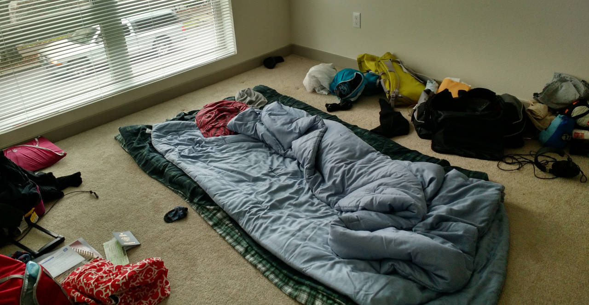

The view from our apartment's rooftop patio makes it tempting to bundle up and grill something soon.

# Tragedy

The last time we chose an apartment without knowing the city,
we ended up in the Tenderloin where [catcalling leads to brutal stabbings](http://abc7news.com/news/sf-man-stabbed-9-times-after-defending-his-girlfriend-/404960/).
For Washington, we booked a full month of AirBnB for $1,800 so we could scope out the area before signing a lease.
As you might imagine, it's tricky to score 31 days of pet-friendly, furnished, walkable
housing so we reserved our place four weeks in advance.

Just *three days* before our flight, the host canceled, leaving us stranded!
Her explanation: "I just don't feel like it anymore."

AirBnB tried to help but was unable to find a walkable place that allowed cats anywhere nearby.
Damn.

Amanda and I scrambled to find a place to stay, with discouraging results.
Fortunately, she's much better at Craigslisting than I am (unless you want to find Nigerian scammers, in which case I'm your man).
She somehow found a $1,500 sublet, in a gorgeous apartment complex, in one of Seattle's best neighborhoods (Capitol Hill).
We were hesitant - too good to be true and so on - but so far it's working out great!

Downstairs, the always-open lounge provides a big-screen TV and plenty of workspace with free wifi.
So far, we've gotten away without hooking up Internet at the new place.
Side effect: less Facebooking, more actual facetime together.

The apartment itself is simple but nice.
I don't love carpet, but it's cozier than hardwoods during Seattle's freezing nights.

Fatty's already at home.

First bed

Second bed
